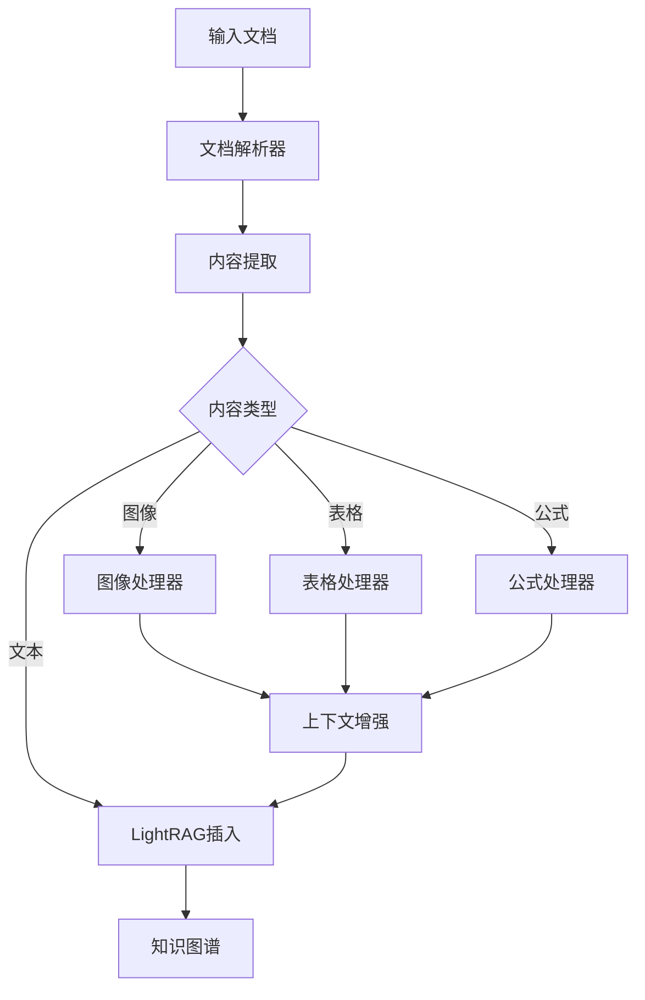
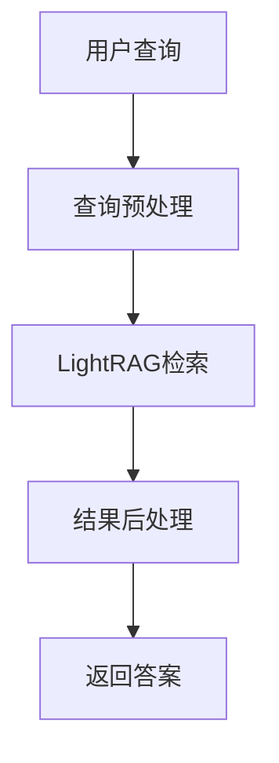

# RAG-Anything 项目架构分析

## 项目概述

RAG-Anything 是一个基于 LightRAG 的多模态文档处理系统，采用模块化设计，支持多种文档格式的解析和智能问答。

## 核心架构

### 1. 主要组件

```
RAG-Anything/
├── raganything/
│   ├── __init__.py          # 包入口，导出主要类
│   ├── config.py            # 配置管理
│   ├── raganything.py       # 核心主类
│   ├── query.py             # 查询功能混入
│   ├── processor.py         # 处理功能混入
│   ├── batch.py             # 批处理功能混入
│   ├── parser.py            # 文档解析器
│   ├── modalprocessors.py   # 多模态处理器
│   └── utils.py             # 工具函数
├── examples/                # 示例代码
└── docs/                   # 文档
```

### 2. 设计模式

#### 2.1 混入模式 (Mixin Pattern)

```python
@dataclass
class RAGAnything(QueryMixin, ProcessorMixin, BatchMixin):
    """通过多重继承组合不同功能模块"""
```

**优势：**
- 功能模块化，职责分离
- 代码复用性高
- 易于扩展和维护

#### 2.2 策略模式 (Strategy Pattern)

```python
# 解析器策略
self.doc_parser = (
    DoclingParser() if self.config.parser == "docling" else MineruParser()
)

# 多模态处理器策略
if self.config.enable_image_processing:
    self.modal_processors["image"] = ImageModalProcessor(...)
if self.config.enable_table_processing:
    self.modal_processors["table"] = TableModalProcessor(...)
```

**优势：**
- 支持多种解析器和处理器
- 运行时可配置
- 易于添加新的处理策略

#### 2.3 工厂模式 (Factory Pattern)

```python
def _create_context_extractor(self) -> ContextExtractor:
    """创建上下文提取器"""
    context_config = self._create_context_config()
    return ContextExtractor(
        config=context_config, 
        tokenizer=self.lightrag.tokenizer
    )
```

## 核心类详解

### 1. RAGAnythingConfig

**职责：** 统一配置管理

**特性：**
- 支持环境变量自动读取
- 提供默认值
- 向后兼容性支持

**主要配置项：**

```python
# 目录配置
working_dir: str = "./rag_storage"
parser_output_dir: str = "./output"

# 解析器配置
parse_method: str = "auto"  # auto, ocr, txt
parser: str = "mineru"      # mineru, docling

# 多模态处理配置
enable_image_processing: bool = True
enable_table_processing: bool = True
enable_equation_processing: bool = True

# 批处理配置
max_concurrent_files: int = 1
supported_file_extensions: List[str] = [".pdf", ".docx", ...]
recursive_folder_processing: bool = True

# 上下文提取配置
context_window: int = 1
context_mode: str = "page"  # page, chunk
max_context_tokens: int = 2000
```

### 2. RAGAnything 主类

**职责：** 核心协调器，整合所有功能

**组件：**

```python
@dataclass
class RAGAnything(QueryMixin, ProcessorMixin, BatchMixin):
    # 核心组件
    lightrag: Optional[LightRAG]           # LightRAG 实例
    llm_model_func: Optional[Callable]     # LLM 模型函数
    vision_model_func: Optional[Callable]  # 视觉模型函数
    embedding_func: Optional[Callable]     # 嵌入函数
    config: Optional[RAGAnythingConfig]    # 配置对象
    
    # 内部状态
    modal_processors: Dict[str, Any]       # 多模态处理器
    context_extractor: ContextExtractor    # 上下文提取器
    doc_parser: Union[MineruParser, DoclingParser]  # 文档解析器
```

### 3. 功能混入类

#### 3.1 QueryMixin
**职责：** 查询功能
- 同步/异步查询接口
- 多种查询模式支持
- 结果格式化

#### 3.2 ProcessorMixin
**职责：** 文档处理功能
- 单文档处理
- 多模态内容处理
- 缓存管理

#### 3.3 BatchMixin
**职责：** 批处理功能
- 并发文档处理
- 进度跟踪
- 错误处理

## 数据流架构

### 1. 文档处理流程



### 2. 查询处理流程



## 扩展点

### 1. 添加新的解析器

```python
class CustomParser:
    def parse(self, file_path: str, **kwargs):
        # 实现自定义解析逻辑
        pass

# 在配置中注册
if self.config.parser == "custom":
    self.doc_parser = CustomParser()
```

### 2. 添加新的模态处理器

```python
class AudioModalProcessor:
    def __init__(self, lightrag, modal_caption_func, context_extractor):
        self.lightrag = lightrag
        self.modal_caption_func = modal_caption_func
        self.context_extractor = context_extractor
    
    async def process(self, audio_data, context):
        # 实现音频处理逻辑
        pass

# 在初始化中注册
if self.config.enable_audio_processing:
    self.modal_processors["audio"] = AudioModalProcessor(...)
```

### 3. 自定义查询模式

```python
class CustomQueryMixin:
    async def custom_query(self, query: str, **kwargs):
        # 实现自定义查询逻辑
        pass

# 通过继承扩展
class ExtendedRAGAnything(RAGAnything, CustomQueryMixin):
    pass
```

## 配置最佳实践

### 1. 环境变量配置

```bash
# .env 文件
WORKING_DIR=./my_rag_storage
PARSER=mineru
PARSE_METHOD=auto
ENABLE_IMAGE_PROCESSING=true
ENABLE_TABLE_PROCESSING=true
MAX_CONCURRENT_FILES=2
```

### 2. 代码配置

```python
# 自定义配置
config = RAGAnythingConfig(
    working_dir="./custom_storage",
    parser="docling",
    enable_image_processing=True,
    max_concurrent_files=4
)

rag = RAGAnything(
    config=config,
    llm_model_func=my_llm_func,
    vision_model_func=my_vision_func,
    embedding_func=my_embedding_func
)
```

### 3. 性能优化配置

```python
# 高性能配置
config = RAGAnythingConfig(
    max_concurrent_files=4,           # 增加并发数
    enable_image_processing=False,    # 关闭不需要的功能
    context_window=0,                 # 减少上下文窗口
    max_context_tokens=1000          # 限制上下文长度
)
```

## 依赖关系

### 1. 核心依赖
- **LightRAG**: 图谱构建和检索
- **MinerU**: 文档解析（默认）
- **Docling**: 备选文档解析器

### 2. 可选依赖
- **OpenAI**: LLM 和嵌入服务
- **Transformers**: 本地模型支持
- **PIL**: 图像处理
- **pandas**: 表格处理

## 总结

RAG-Anything 采用了优秀的软件架构设计：

1. **模块化设计**: 通过混入模式实现功能分离
2. **可配置性**: 支持环境变量和代码配置
3. **可扩展性**: 易于添加新的解析器和处理器
4. **性能优化**: 支持批处理和并发处理
5. **向后兼容**: 保持 API 稳定性

这种架构使得系统既灵活又稳定，适合各种规模的应用场景。